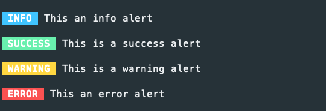
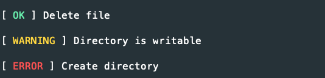

# Console


> Checkout [Command Line Interface Guidelines](https://clig.dev/#arguments-and-flags) for information on naming and best practices.

The console component is to make console utilities and applications, there is no plan for a command runner.

## Command

Create a `Command` in your `app\Command` folder.

```php
<?php declare(strict_types=1);

namespace App\Command;

use Lightning\Console\Arguments;
use Lightning\Console\Console;
use Lightning\Console\AbstractCommand as Command;


class HelloWorldCommand extends Command
{
    protected string $name = 'hello';
    protected string $description = 'hello world command';

    protected function initialize(): void
    {
        $this->addArgument('name', [
            'description' => 'name to use',
            'default' => 'world'
        ]);
    }

    protected function execute(Arguments $args): int
    {
        $console = $this->getConsole();

        $console->out('Hello %s!', $args->getArgument('name'));

        return self::SUCCESS;
    }
}
```

Create a file `bin/hello`  and run `chmod +x bin/hello`

```bash
#!/usr/bin/env php
<?php

use App\Command\DevCommand;
use Lightning\Console\Console;
use Lightning\Console\Formatter\OutputFormatter;

include dirname(__DIR__) . '/config/bootstrap_cli.php';

$command = new HelloCommand(new Console());
exit($command->run($argv));
```
## Output Formatters

```php
$formatter = new StyleFormatter();
$formatter-format('Hello');
$formatter-format('Hello %s', $name);
```

There are two output formatters both which use sprintf and strip ANSI escape sequences when ANSI is disabled. The `StyleFormatter` extends the `OutputFormatter` and allows you to setup your own ANSI styles then use them easily with tags.


```php
$formatter = new StyleFormatter();
$formatter-format('Hello <green>Jim</green>');
$formatter-format('Hello <green>%s</green>', $name);

$formatter->setStyle('emergency', [ANSI::FG_WHITE, ANSI::BOLD, ANSI::BG:RED]);
$formatter->format('<emergency>Something went wrong>');
```

If you want to use one of the output formatters, you can add this to the constructor of your command then set this up in bash file to autodetect.

```php
$formatter = (new OutputFormatter())->setAnsiMode(posix_isatty(STDOUT)); 
```

## Console Application

To create a Console Application 

```bash
#!/usr/bin/env php
<?php
use Lightning\Console\ConsoleIo;
use function Lightning\Dotenv\env;
use Lightning\Migration\Migration;
use Lightning\Console\ConsoleApplication;
use Lightning\Console\ConsoleArgumentParser;
use Lightning\Migration\Command\MigrateUpCommand;
use Lightning\Migration\Command\MigrateDownCommand;

include dirname(__DIR__) . '/config/bootstrap_cli.php';


$pdo = new PDO(env('DB_DSN'), env('DB_USERNAME'), env('DB_PASSWORD'));
$migration = new Migration($pdo, dirname(__DIR__) . '/database/migrations');

$console = new Console();
$application = new ConsoleApplication($console);
$application->setName('migrate')
            ->setDescription('Database migration');
            
$application->add(new MigrateUpCommand($console, $migration));
$application->add(new MigrateDownCommand($console, $migration));
exit($application->run($argv));
```

## Console

The `Console` object allows you to access output and input on the console device.


```php
$console->out('hello'); // to stdout
$console->out('hello %s', 'Amanda'); // to stdout
$console->error('opps'); // to stderr
$console->error('An error occured in %s', get_class(__FILE__)); // to stderr
$input = $console->readLine(); // reads a line from stdin
$password = $console->readPassword(); // reads a line from stdin with echoing disabled
```

## Helpers

## Inputs

```php
$helper = new InputHelper($console);
$name = $helper->ask();
$continue = $helper->ask('Continue ?','n'); // adds a default 
$continue = $helper->askChoice('Continue ? (name)',['y','n']); 
```

### Alerts

Display alerts to users, warning and error will be displayed `stderr`.

```php
$helper = new AlertHelper($console);
$helper->info('INFO', 'This an info alert');
$helper->success('SUCCESS', 'This is a success alert');
$helper->warning('WARNING', 'This is a warning alert');
$helper->error('ERROR', 'This an error alert');
```



### Progress Bar

Display a progress bar to user

```php
$helper = new ProgressBarHelper($console);

$helper->setMaximum(10)
        ->start();

$helper->increment();

$helper->complete(); // displays at 100% and adds new line
```

You can also manually set

```php
$helper->setValue(100);
$helper->increment(mb_strlen($chunk)); 
```


### StatusList

Often when running commands you are carrying out multiple tasks, and its nice to show these to the user. This
is where the status method comes in handy, statuses are setup for `ok` and `error`.

```php
$status = new StatusListBarHelper($console);
$status->out('ok', 'Configuration file found');
$status->out('error', 'Could not create directory /tmp');
```



You can also add your own status

```php
$helper->setStatus('warning', [ANSI::FG_YELLOW, ANSI::FG_BOLD]);
```


## Testing

Create your PHP test file and add the `ConsoleIntegrationTestTrait`, then create the `Command` object using the `TestConsole` and call the `setupIntegrationTesting` function.


```php
<?php declare(strict_types=1);

namespace App\Command;

use PHPUnit\Framework\TestCase;
use Lightning\Console\TestSuite\ConsoleIntegrationTestTrait;

final class HelloWordCommandTest extends TestCase
{
    use ConsoleIntegrationTestTrait;

    public function setUp(): void 
    {
        $command = new HelloWorldCommand(new TestConsole());
        $this->setupIntegrationTesting($command);
    }


    public function testExitSuccesss(): void
    {
        $this->execute();
        $this->assertExitSuccess();
        $this->assertOutputContains('Hello world!');
    }
}
```

To execute the `Command` with arguments

```php
$this->execute(['--bold','jon']);
```

If your command asks for input from the user, you can pass the input in the `execute method`

```php
$this->execute([],['jon']);
```

### Assertion methods

```php
$this->assertExitSuccess();
$this->assertExitError();
$this->assertExitCode(3);

// stdout
$this->assertOutputContains('x');
$this->assertOutputNotContains('x');
$this->assertOutputEmpty();
$this->assertOutputNotEmpty();

$this->assertOutputMatchesRegularExpression('/foo/');
$this->assertOutputDoesNotMatchRegularExpression('/foo/');

// stderr
$this->assertErrorContains('x');
$this->assertErrorNotContains('x');
$this->assertErrorEmpty();
$this->assertErrorNotEmpty();

$this->assertErrorMatchesRegularExpression('/foo/');
$this->assertErrorDoesNotMatchRegularExpression('/foo/');
```